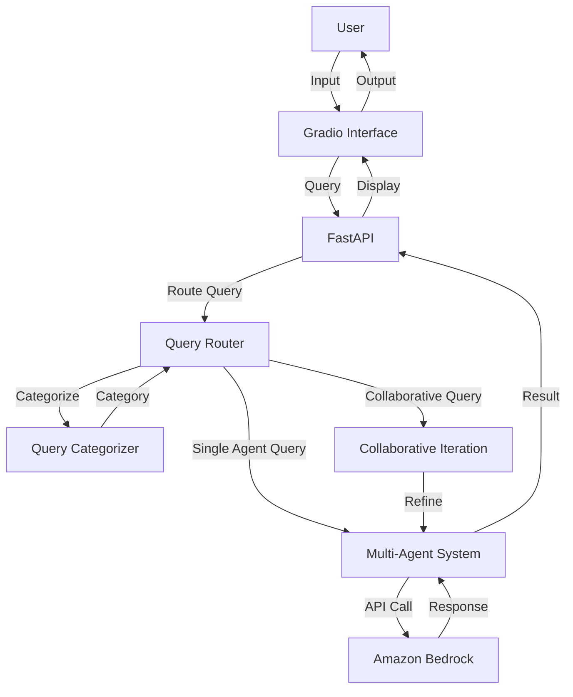

# Multi-Agent AI System Documentation

## Table of Contents

1. [Overview](#1-overview)
2. [System Architecture](#2-system-architecture)
3. [Components](#3-components)
4. [Installation & Deployment](#4-installation--deployment)
5. [Configuration](#5-configuration)
6. [Usage](#6-usage)
7. [API Reference](#7-api-reference)
8. [Security Considerations](#8-security-considerations)
9. [Monitoring & Logging](#9-monitoring--logging)
10. [Troubleshooting](#10-troubleshooting)
11. [Development Guide](#11-development-guide)
12. [Maintenance & Operations](#12-maintenance--operations)

## 1. Overview

The Multi-Agent AI System is a sophisticated application designed to handle complex queries through a collaborative approach using multiple specialized AI agents. It leverages Amazon's Bedrock service to access various Claude AI models, providing a versatile and powerful solution for a wide range of tasks, including problem-solving, analysis, coding, and visual interpretation.

Key features:
- Multiple specialized AI agents for different types of tasks
- Dynamic query routing and agent collaboration
- Support for text and image inputs
- User-friendly chat interface using Gradio
- Integration with Amazon Bedrock for accessing advanced AI models

This system is ideal for organizations and individuals seeking a comprehensive AI assistant capable of handling diverse and complex queries with high accuracy and depth.

## 2. System Architecture



1. User Interface: A web-based chat interface for user interactions.
2. FastAPI Server: Handles HTTP requests and serves the Gradio interface.
3. Gradio Interface: Provides an interactive chat experience.
4. Query Router: Categorizes and directs queries to appropriate agents.
5. Multi-Agent System: Manages and coordinates multiple specialized AI agents.
6. Individual Agents: Specialized AI agents for different tasks.
7. Amazon Bedrock: Cloud-based AI service providing access to Claude models.

## 3. Components

### 3.1 AgentBase

- Purpose: Serves as the foundation for all specialized agents.
- Core Functionality: Handles communication with Amazon Bedrock.
- Technologies: Python, boto3

### 3.2 Specialized Agents

- Types: ReflectionAgent, SolutionAgent, InquiryAgent, GuidanceAgent, VisualAgent, CodingAgent, AnalyticsAgent, ReasoningAgent
- Purpose: Each agent specializes in a specific type of task or domain.
- Core Functionality: Process queries and generate responses within their expertise.
- Technologies: Python, Claude AI models

### 3.3 MultiAgentSystem

- Purpose: Manages and coordinates multiple agents.
- Core Functionality: Routes queries to appropriate agents and facilitates collaboration.
- Technologies: Python

### 3.4 QueryRouter

- Purpose: Categorizes incoming queries and determines the appropriate agent(s) to handle them.
- Core Functionality: Analyzes queries, decides on single or multi-agent approach, and manages collaborative iterations.
- Technologies: Python, Claude AI for query categorization

### 3.5 Gradio Interface

- Purpose: Provides a user-friendly web interface for interacting with the system.
- Core Functionality: Handles user inputs (text and images) and displays AI responses.
- Technologies: Gradio, Python

### 3.6 FastAPI Server

- Purpose: Serves the web application and handles HTTP requests.
- Core Functionality: Integrates Gradio with FastAPI for web deployment.
- Technologies: FastAPI, Uvicorn

## 4. Installation & Deployment

Prerequisites:
- Python 3.10+
- pip (Python package manager)
- AWS account with Bedrock access

Steps:

1. Clone the repository:
   ```
   git clone https://github.com/mohammaddaoudfarooqi/Multi-Agent-AI.git
   cd multi-agent-ai
   ```

2. Install dependencies:
   ```
   pip install -r requirements.txt
   ```

3. Set up environment variables:
   Create a `.env` file in the project root with the following:
   ```
   AWS_ACCESS_KEY_ID=your_access_key
   AWS_SECRET_ACCESS_KEY=your_secret_key
   AWS_REGION=your_aws_region
   MONGODB_URI=your_mongodb_uri
   ```

4. Run the application:
   ```
   python main.py
   ```

The server will start on `http://0.0.0.0:7860`.

## 5. Configuration

Key configuration options are managed through environment variables and the `claude_models` dictionary in `agents.py`.

Environment Variables:
- `AWS_ACCESS_KEY_ID`: Your AWS access key
- `AWS_SECRET_ACCESS_KEY`: Your AWS secret access key
- `AWS_REGION`: AWS region for Bedrock service
- `MONGODB_URI`: MongoDB connection string

Claude Models Configuration:
```python
claude_models = {
    "Claude 3.5 Sonnet (US, v2)": "us.anthropic.claude-3-5-sonnet-20241022-v2:0",
    "Claude 3.5 Sonnet": "anthropic.claude-3-5-sonnet-20240620-v1:0",
    # ... other models ...
}
```

## 6. Usage

1. Access the web interface at `http://localhost:7860`.
2. Type your query in the chat input or upload an image.
3. The system will process your query, route it to the appropriate agent(s), and display the response.

Example queries:
- "How can I improve my leadership skills?"
- "What are the best practices for creating a scalable AI architecture?"
- "Analyze this image and describe its contents." (with an uploaded image)

## 7. API Reference

The system primarily uses a chat interface, but the underlying FastAPI server can be extended for API endpoints if needed.

## 8. Security Considerations

- Ensure AWS credentials are kept secure and not exposed in the code.
- Use HTTPS for production deployments.
- Implement user authentication for the chat interface in production.
- Secure MongoDB connection string and limit database access permissions.

## 9. Monitoring & Logging

- AWS CloudWatch can be integrated for monitoring Bedrock usage.
- Implement application-level logging for query processing and agent interactions.
- Monitor MongoDB performance and usage.

## 10. Troubleshooting

Common issues:
- AWS credential errors: Verify `.env` file configuration.
- Model unavailability: Check Bedrock service status and quotas.
- High latency: Monitor network connection and Bedrock response times.
- MongoDB connection issues: Verify connection string and network access.

## 11. Development Guide

- The codebase is organized around the main components: agents, router, and interface.
- To add a new agent type, create a new class inheriting from `AgentBase` and implement the `respond` method.
- Use Python type hints and docstrings for better code readability.
- Extend the `Tools` class in `tools.py` to add new functionalities like web search or database interactions.

## 12. Maintenance & Operations

- Regularly update dependencies, especially Gradio, boto3, and MongoDB drivers.
- Monitor AWS Bedrock usage and costs.
- Keep Claude model IDs updated in the `claude_models` dictionary.
- Perform regular backups of MongoDB data.
- Implement a CI/CD pipeline for automated testing and deployment.

This documentation provides a comprehensive overview of the Multi-Agent AI System. For further assistance or contributions, please refer to the project's GitHub repository or contact the development team.