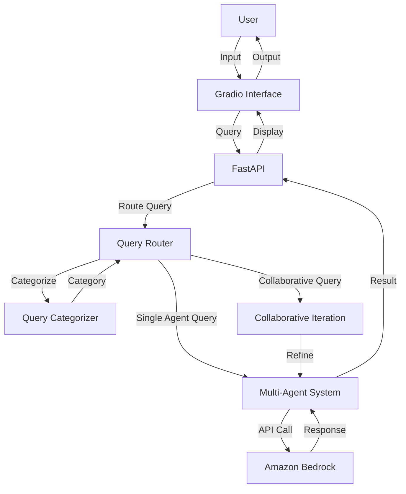

# Multi-Agent AI System Documentation

## Table of Contents

1. [Overview](#1-overview)
2. [System Architecture](#2-system-architecture)
3. [Components](#3-components)
4. [Installation & Deployment](#4-installation--deployment)
5. [Configuration](#5-configuration)
6. [Usage](#6-usage)
7. [API Reference](#7-api-reference)
8. [Security Considerations](#8-security-considerations)
9. [Monitoring & Logging](#9-monitoring--logging)
10. [Troubleshooting](#10-troubleshooting)
11. [Development Guide](#11-development-guide)
12. [Maintenance & Operations](#12-maintenance--operations)

## 1. Overview

The Multi-Agent AI System is a sophisticated application designed to handle complex queries through a collaborative approach using multiple specialized AI agents. It leverages Amazon's Bedrock service to access various AI models, providing a versatile and powerful solution for a wide range of tasks, including problem-solving, analysis, coding, and visual interpretation.

Key features:
- Multiple specialized agents for different types of tasks
- Dynamic query routing based on input categorization
- Collaborative problem-solving among agents
- Integration with external tools like MongoDB for enhanced responses
- A user-friendly chat interface built with Gradio
- Support for both text and image inputs

This Multi-Agent AI System is ideal for organizations looking to implement a versatile AI assistant capable of handling diverse user queries, from general inquiries to specialized tasks like coding, data analysis, and visual interpretation.

## 2. System Architecture



1. User Interface: A web-based chat interface for user interactions.
2. FastAPI Server: Handles HTTP requests and serves the Gradio interface.
3. Gradio Interface: Provides an interactive chat experience.
4. Query Router: Categorizes and directs queries to appropriate agents.
5. Multi-Agent System: Manages and coordinates multiple specialized AI agents.
6. Individual Agents: Specialized AI agents for different tasks.
7. Amazon Bedrock: Cloud-based AI service providing access to various models.

## 3. Components

### 3.1 AgentBase

- **Purpose**: Serves as the foundation for all specialized agents.
- **Core Functionality**: Handles communication with Amazon Bedrock.
- **Technologies**: Python, boto3

### 3.2 Tools

The `Tools` class provides utility functions for the agents, particularly for interacting with external data sources.

- **Key Features**:
  - MongoDB Atlas integration for hybrid searches (combining full-text and vector-based)
  - Utilizes BedrockEmbeddings for generating embeddings

**Usage Example**:
```python
tools = Tools(
    mongodb_uri="your_mongodb_uri",
    mongodb_db="your_database_name",
    mongodb_collection="your_collection_name"
)
results = tools.search_mongodb("user query")
```

### 3.3 Specialized Agents

The Multi-Agent System comprises several specialized agents, each inheriting from the `AgentBase` class:

- **ReflectionAgent**: Provides self-reflective analysis
- **SolutionAgent**: Solves problems step-by-step
- **InquiryAgent**: Answers questions using MongoDB search results
- **GuidanceAgent**: Offers mentorship and professional advice
- **VisualAgent**: Analyzes and interprets images
- **CodingAgent**: Reviews and generates code
- **AnalyticsAgent**: Performs data analysis and provides insights
- **ReasoningAgent**: Applies logical reasoning to scenarios

Each agent is initialized with a specific AI model and can process queries using the `respond` method.

**Example Agent Initialization**:
```python
reflection_agent = ReflectionAgent("Reflection Agent", os.getenv("REFLECTION_AGENT"))
```

### 3.4 MultiAgentSystem

- **Purpose**: Manages and coordinates multiple agents.
- **Core Functionality**: Routes queries to appropriate agents and facilitates collaboration.
- **Technologies**: Python

### 3.5 QueryRouter

The `QueryRouter` class is responsible for categorizing incoming queries and routing them to the appropriate agent(s).

- **Key Functionalities**:
  - Query categorization using a dedicated ReflectionAgent
  - Parsing of categorization results
  - Handling of collaborative responses among multiple agents

**Usage Example**:
```python
query_router = QueryRouter(multi_agent_system)
async for response in query_router.route_query("user query"):
    print(response)
```

### 3.6 Gradio Interface

The user interface is built using Gradio, providing a chat-like experience for interacting with the Multi-Agent System.

- **Key Features**:
  - Support for text and image inputs
  - Real-time streaming of agent responses
  - Customizable CSS for improved aesthetics

The interface is defined in the `interface.py` file and can be easily integrated into other applications.

### 3.7 FastAPI Server

- **Purpose**: Serves the web application and handles HTTP requests.
- **Core Functionality**: Integrates Gradio with FastAPI for web deployment.
- **Technologies**: FastAPI, Uvicorn

### 3.8 Main Application

The main application (`main.py`) ties all components together and serves the Gradio interface using FastAPI.

## 4. Installation & Deployment

Prerequisites:
- Python 3.10+
- pip (Python package manager)
- AWS account with Bedrock access

Steps:

1. Clone the repository:
   ```
   git clone https://github.com/mohammaddaoudfarooqi/Multi-Agent-AI.git
   cd multi-agent-ai
   ```

2. Install dependencies:
   ```
   pip install -r requirements.txt
   ```

3. Set up environment variables:
   Create a `.env` file in the project root with the following:
   ```
   AWS_ACCESS_KEY_ID=your_access_key
   AWS_SECRET_ACCESS_KEY=your_secret_key
   AWS_REGION=your_aws_region
   MONGODB_URI=your_mongodb_uri
   ```

4. Run the application:
   ```
   python main.py
   ```

The server will start on `http://0.0.0.0:7860`.

## 5. Configuration

Key configuration options are managed through environment variables in the `.env` file.

Environment Variables:
- `AWS_ACCESS_KEY_ID`: Your AWS access key
- `AWS_SECRET_ACCESS_KEY`: Your AWS secret access key
- `AWS_REGION`: AWS region for Bedrock service
- `MONGODB_URI`: MongoDB connection string
- `REFLECTION_AGENT`: Model ID for Reflection Agent
- `SOLUTION_AGENT`: Model ID for Solution Agent
- `INQUIRY_AGENT`: Model ID for Inquiry Agent
- `GUIDANCE_AGENT`: Model ID for Guidance Agent
- `VISUAL_AGENT`: Model ID for Visual Agent
- `CODING_AGENT`: Model ID for Coding Agent
- `ANALYTICS_AGENT`: Model ID for Analytics Agent
- `REASONING_AGENT`: Model ID for Reasoning Agent

## 6. Usage

1. Access the web interface at `http://0.0.0.0:7860`.
2. Type your query in the chat input or upload an image.
3. The system will process your query, route it to the appropriate agent(s), and display the response.

Example queries:
- "How can I improve my leadership skills?"
- "What are the best practices for creating a scalable AI architecture?"
- "Analyze this image and describe its contents." (with an uploaded image)

## 7. API Reference

The system primarily uses a chat interface, but the underlying FastAPI server can be extended for API endpoints if needed.

## 8. Security Considerations

- Ensure AWS credentials are kept secure and not exposed in the code.
- Use HTTPS for production deployments.
- Implement user authentication for the chat interface in production.
- Secure MongoDB connection string and limit database access permissions.
- Regularly rotate AWS access keys and review IAM permissions.

## 9. Monitoring & Logging

- AWS CloudWatch can be integrated for monitoring Bedrock usage.
- Implement application-level logging for query processing and agent interactions.
- Monitor MongoDB performance and usage.
- Set up alerts for unusual activity or errors in the system.

## 10. Troubleshooting

Common issues:
- AWS credential errors: Verify `.env` file configuration.
- Model unavailability: Check Bedrock service status and quotas.
- High latency: Monitor network connection and Bedrock response times.
- MongoDB connection issues: Verify connection string and network access.
- Image processing errors: Ensure proper file formats and sizes are supported.

## 11. Development Guide

- The codebase is organized around the main components: agents, router, and interface.
- To add a new agent type, create a new class inheriting from `AgentBase` and implement the `respond` method.
- Use Python type hints and docstrings for better code readability.
- Extend the `Tools` class in `tools.py` to add new functionalities like web search or database interactions.
- Follow PEP 8 style guidelines for Python code.
- Write unit tests for new features and ensure existing tests pass before committing changes.

## 12. Maintenance & Operations

- Regularly update dependencies, especially Gradio, boto3, and MongoDB drivers.
- Monitor AWS Bedrock usage and costs.
- Keep AI model IDs updated in the environment variables.
- Perform regular backups of MongoDB data.
- Implement a CI/CD pipeline for automated testing and deployment.
- Schedule periodic reviews of system performance and user feedback to identify areas for improvement.

This documentation provides a comprehensive overview of the Multi-Agent AI System. For further assistance or contributions, please refer to the project's GitHub repository or contact the development team.